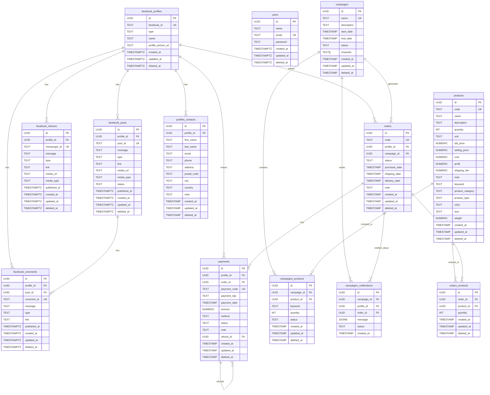

# Facebook Database ER Diagram

This diagram represents the database schema for the Facebook integration system.

## Table Descriptions

### Core Facebook Tables
- **facebook_profiles**: Stores Facebook page and user profiles
- **facebook_posts**: Facebook posts from profiles
- **facebook_comments**: Comments on Facebook posts
- **facebook_inboxes**: Facebook Messenger inbox messages

### Business Logic Tables
- **users**: System users for authentication
- **products**: Product catalog with pricing and inventory
- **profiles_contacts**: Contact information for Facebook profiles
- **campaigns**: Marketing campaigns
- **orders**: Customer orders
- **payments**: Payment transactions
- **campaigns_products**: Many-to-many relationship between campaigns and products
- **campaigns_notifications**: Notifications sent for campaigns
- **orders_products**: Many-to-many relationship between orders and products

## Key Features
- UUID primary keys for all tables
- Soft delete support with `deleted_at` timestamps
- Audit trails with `created_at` and `updated_at` timestamps
- Foreign key constraints with CASCADE delete
- Check constraints for data validation
- Unique constraints on business identifiers
- Generated columns (profit calculation in products)
- JSONB support for flexible data storage (campaigns_notifications.message)